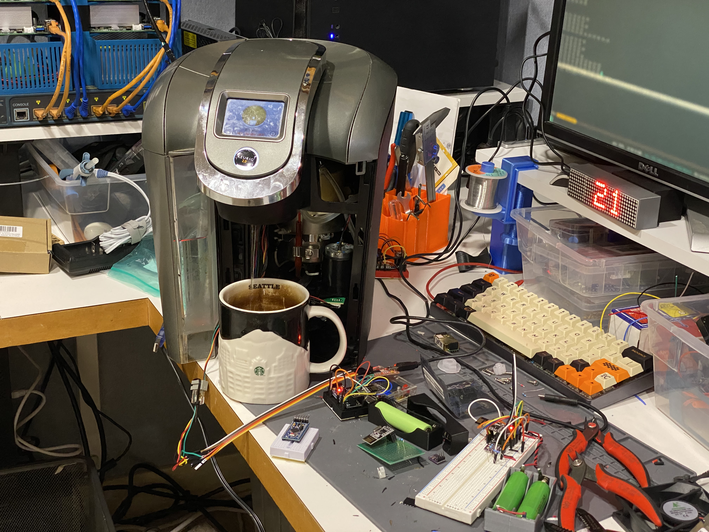

# Keurig 2.0 service port reverse engineering notes

This is living document containing results of reverse engineering of Keurig 2.0 RJ11 service port.



## Wiring

RJ11 jack. Looking from the top of pins:
- Black - always 3.3V
- Red - always 3.3V 
- Green - UART TX. 3.3V in normal state. 9600. 8N1
- Yellow - Ground

## General protocol (speculation)

`00 <size of message without first 2 bytes> <data>`

## Messages

### Got power/boot

Reports after plugging in unit to power

`08 04 18`

### Power on (screen button) / periodic checkin

`01 04 TT TT ?? ?? ss ss SS SS MM MM LL LL 00 00 00 00 00 00 00 00 00 01 00 01 00 0a 01 4f 00`

Total statistics:

- bytes 2-3 (T) - total number of brews
- bytes 6-7 (s) - number of 4oz brews
- bytes 8-9 (S) - number of 6oz brews
- bytes 10-11 (M) - number of 8oz brews
- bytes 12-13 (L) - number of 10oz brews

in my experiments: `T - s+S+M+L = 2`. So possibly the rest of data are counters too (for pitchers etc).
There are two 01, which might be the missing cups.

Investigation:
```
01 04 19 4c 8e 72 00 49 01 66 0a 86 0c b5 00 00 00 00 00 00 00 00 00 01 00 01 00 0a 01 4f 00
01 04 19 53 8e 76 00 5c 01 b8 0a 87 0c b6 00 00 00 00 00 00 00 00 00 01 00 01 00 0a 01 4f 00
         ^^    ^^    ^^    ^^    ^^    ^^
01 04 19 54 8e 76 00 5d 01 b8 0a 87 0c b6 00 00 00 00 00 00 00 00 00 01 00 01 00 0a 01 4f 00
               ^^          ^^
- +1 4oz cocoa
05 04 19 57 8e 7f 00 5d 01 b8 0a 87 0c b9 00 00 00 00 00 00 00 00 00 01 00 01 00 0a 01 4f
01 04 19 58 8e 7f 00 5e 01 b8 0a 87 0c b9 00 00 00 00 00 00 00 00 00 01 00 01 00 0a 01 4f 00
01 04 19 59 8e 7f 00 5e 01 b9 0a 87 0c b9 00 00 00 00 00 00 00 00 00 01 00 01 00 0a 01 4f 00
01 04 19 5a 8e 7f 00 5e 01 b9 0a 88 0c b9 00 00 00 00 00 00 00 00 00 01 00 01 00 0a 01 4f 00
^^       ^^    ^^                      ^^
- +3 10oz strong            
      ----- total number of cups?
            ----- counter
                  ----- 4 oz cups
                        ----- 6 oz cups
                              ----- 8 oz cups
                                    ----- 10 oz cups
```

- first byte possibly indicates power-on (1) or periodic check-in (5). Also type-5 messages are 1 byte shorter.

- not a serial. Last group of s/n should contain at least 3 bytes.
- not a contents of settings
- not internal clock.
- not a number of power-ons. Hard or soft.


### Power off (screen button)

`02 04 00`

### Brew started

`03 04 .. ..`

need more investigation about "hot water": `03 04 18 60`

- byte 2: ..SS ....
  - bits4-5 - brew size
    - 00 - 4oz
    - 01 - 6oz
    - 10 - 8oz
    - 11 - 10oz
  - bit 3  - hot water?

- byte 3: SCW. ....
  - bit7 (S) - strong
  - bit6 (C) - cocoa/other
  - bit5 (W) - hot water (set with cocoa)

### Brew ended

`06 04 ..`

Hot water:
- byte 2: 40 or 43 - prolly amount of dispenced water. Need more investigation.

Program brew:
- byte 2: 1100 XXXX
  - Last 4 bits has exact translation to cup size
  - 4 - 4oz
  - 6 - 6oz
  - 8 - 8oz
  - a - 10oz

No indication of strong/cocoa

### Need more water

`0d 04 03` 

or

`0d 04 02` 

last bit might indicate if lid was opened after the message. 1 - no / 0 - yes.

## Settings reporting

### Clock/wallpaper

`09 04 .. .. ..`

- bytes 2-3: DAHH HHHM MMMM MWWW W000
  - D - digital/analog clocks. 1 - digital
  - A - 12/24 clock display. 1 - 24, 0 - am/pm
  - H - Hours 0-23
  - M - Minutes 0-59
  - W - Selected wallpaper. 0-15
  
BUG: clock set in 24hr mode to 12:xx results clock to be set at 00:xx. In 12hr mode everything is fine.

### reseroir light

`0b 04 .. .. .. ..`

- bytes 2-5: LLo0 hhhh  mmmm mm0O  0HHH HMMM  MMM0 0000
  - LL - light color. 0-3
  - o - night light off timer. 1 - enabled
  - h - night light off hours. looks like only 0-11 are counted. bug?
  - m - night light off minutes
  - O - night light on timer. 1 - enabled
  - H - night light on hours. looks like only 0-11 are counted. bug?
  - M - night light on minutes

### Water filter reminder

Set: `0c 04 ..`

- byte 2: R000 0000
  - R - water filter reminder. 1 - on

Pop-up reminder:
`0c 04 88` - not now
- (?) bit-3 has action taken. 1 - "not now"

### Settings without any reporting

- Auto on/off energy savings
- High Altitude setting

