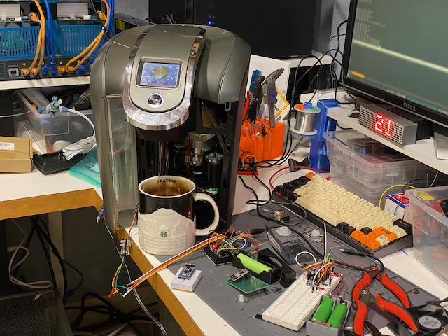

# Keurig 2.0 service port reverse engineering notes

This is living document containing results of reverse engineering of Keurig 2.0 RJ11 service port.



## Wiring

RJ11 jack. Looking from the top of pins:
- Black - always 3.3V
- Red - always 3.3V 
- Green - UART TX. 3.3V in normal state. 9600. 8N1
- Yellow - Ground

## General protocol (speculation)

`00 <size of message without first 2 bytes> <data>`

## Messages

### Got power/boot

Reports after plugging in unit to power

`00 03 08 04 18`

### Power on (screen button)

Got various results.
```
00 1f 01 04 19 4c 8e 72 00 49 01 66 0a 86 0c b5 00 00 00 00 00 00 00 00 00 01 00 01 00 0a 01 4f 00
00 1f 01 04 19 53 8e 76 00 5c 01 b8 0a 87 0c b6 00 00 00 00 00 00 00 00 00 01 00 01 00 0a 01 4f 00
               ^^    ^^    ^^    ^^    ^^    ^^
00 1f 01 04 19 54 8e 76 00 5d 01 b8 0a 87 0c b6 00 00 00 00 00 00 00 00 00 01 00 01 00 0a 01 4f 00
               ^^          ^^
- +1 4oz cocoa
      05 04 19 57 8e 7f 00 5d 01 b8 0a 87 0c b9 00 00 00 00 00 00 00 00 00 01 00 01 00 0a 01 4f
      ^^       ^^.   ^^.                     ^^
- +3 10oz strong            
```

- not a serial. Last group of s/n should contain at least 3 bytes.
- not a contents of settings
- not internal clock.
- not a number of power-ons. Hard or soft.


### Power off (screen button)

`00 03 02 04 00`

### Brew started

`00 04 03 04 .. ..`

- byte 4: ..SS ....
  - bits4-5 - brew size
    - 00 - 4oz
    - 01 - 6oz
    - 10 - 8oz
    - 11 - 10oz

- byte 5: SC.. ....
  - bit7 (S) - strong
  - bit6 (C) - cocoa/other

### Brew ended

`00 03 06 04 ..`

- byte 4: 1100 XXXX
  - Last 4 bits has exact translation to cup size
  - 4 - 4oz
  - 6 - 6oz
  - 8 - 8oz
  - a - 10oz

### Need more water

`00 03 0d 04 03` 

or

`00 03 0d 04 02` 

last bit might indicate if lid was opened after the message. 1 - no / 0 - yes.

## Settings reporting

### Clock/wallpaper

`00 05 09 04 .. .. ..`

- bytes 4-6: DAHH HHHM MMMM MWWW W000
  - D - digital/analog clocks. 1 - digital
  - A - 12/24 clock display. 1 - 24, 0 - am/pm
  - H - Hours 0-23
  - M - Minutes 0-59
  - W - Selected wallpaper. 0-15

### reseroir light

`00 06 0b 04 .. .. .. ..`

- bytes 4-7: LLo0 hhhh  mmmm mm0O  0HHH HMMM  MMM0 0000
  - LL - light color. 0-3
  - o - night light off timer. 1 - enabled
  - h - night light off hours. looks like only 0-11 are counted. bug?
  - m - night light off minutes
  - O - night light on timer. 1 - enabled
  - H - night light on hours. looks like only 0-11 are counted. bug?
  - M - night light on minutes

### Water filter reminder

`00 03 0c 04 ..`

- byte 4: R000 0000
  - R - water filter reminder. 1 - on


### Settings without any reporting

- Auto on/off energy savings
- High Altitude setting
- Water Filter Reminder

